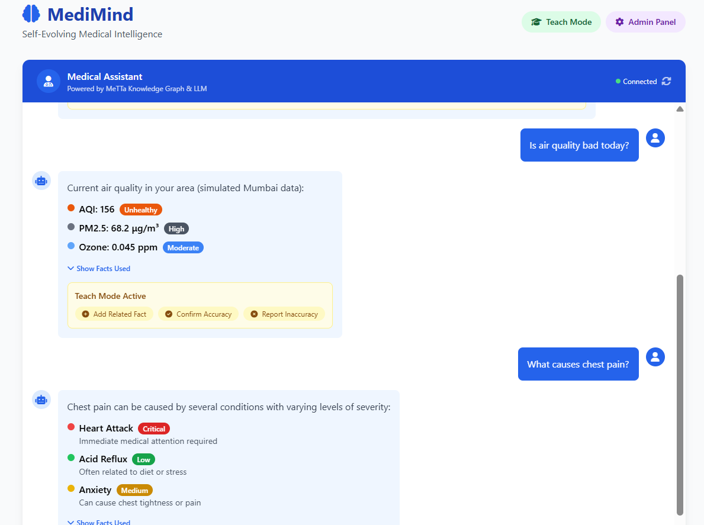

# 🧠 MediMind – The Self-Evolving Medical Intelligence


> **A MeTTa-Powered, Explainable, and Self-Learning Healthcare Assistant**

[](https://singularitynet.io)
[](https://metta-lang.dev)
[](https://python.org)
[](https://groq.com)

**MediMind** is a next-generation healthcare chatbot that combines **symbolic AI (MeTTa)** with **neural AI (LLM)** to deliver **accurate, explainable, and self-improving** medical insights.

Unlike black-box chatbots, MediMind **grounds every answer in a structured knowledge graph**, explains its reasoning, and learns from user feedback — making it **trustworthy, transparent, and adaptive**.

🎯 **Hackathon Problem Statement 1**: *Domain-Specific FAQ Chatbot with Knowledge Graph Integration*

---

## 🎯 Why MediMind?

Traditional healthcare chatbots fail because they:
- ❌ Hallucinate answers  
- ❌ Lack explainability  
- ❌ Can’t adapt to new knowledge  
- ❌ Ignore real-world context  

**MediMind solves this by:**
- ✅ Using **MeTTa for structured, verifiable reasoning**  
- ✅ Leveraging **LLMs for natural language understanding**  
- ✅ Providing **proof paths** for every answer  
- ✅ Supporting **real-time learning** from user feedback  
- ✅ Integrating **external data** (e.g., air quality, disease outbreaks)  

This is **Graph RAG at its best** — where AI doesn’t just answer, it **understands**.  

---

## 🚀 Features

| Feature | Description |
|---------|-------------|
| ✅ **MeTTa Knowledge Graph** | Rich, structured medical facts with relationships, hierarchies, and dependencies |
| ✅ **Explainable AI** | Every answer includes a **proof path** showing the reasoning chain |
| ✅ **AI-Driven Querying** | LLM acts as a "semantic router" — no hardcoded intents |
| ✅ **Self-Learning** | Users can correct the bot, which updates the knowledge graph in real time |
| ✅ **Real-Time Data** | Integrates air quality, disease outbreaks, and more |
| ✅ **Interactive UI** | TailwindCSS frontend with D3.js knowledge graph visualization |
| ✅ **MeTTa-Python Integration** | Flask backend with CORS + dynamic knowledge updates |

---

## 🔧 Tech Stack

| Layer        | Technology |
|--------------|------------|
| **Frontend** | HTML, JavaScript, TailwindCSS, D3.js |
| **Backend**  | Python, Flask, CORS |
| **AI Engine**| MeTTa (via `hyperon`), Groq Cloud (Llama 3 70B) |
| **Knowledge Base** | `metta_kb/medical.metta` |
| **Deployment** | Local demo (Flask) → Future: SingularityNET |

---

## 🏗️ Architecture

```mermaid
flowchart TD
    A[User] --> B[Frontend (HTML/JS)]
    B --> C[Flask API Orchestrator]
    C --> D[MeTTa Engine<br/>Symbolic Reasoning]
    C --> E[LLM (Groq)<br/>Semantic Routing]
    C --> F[External APIs<br/>Air Quality, Disease Data, Drugs]
    C --> G[Self-Learning Engine]


📦 Installation & Setup

1. Clone the Repository
git clone https://github.com/your-username/medimind.git
cd medimind

2. Create Virtual Environment

python -m venv venv
source venv/bin/activate  # Linux/Mac
# venv\Scripts\activate   # Windows

3. Install Dependencies

pip install flask flask-cors groq python-dotenv

4. Set Up Environment Variables

Create a .env file:


GROQ_API_KEY=your_groq_api_key_here
FLASK_SECRET_KEY=replace_with_your_secret

👉 Get your Groq API key from console.groq.com.

5. Run the App

python app.py
Open your browser at 👉 http://localhost:5000

🌐 API Endpoints
Method	Endpoint	Description
GET	/	Serve the frontend
POST	/ask	Ask a question → get answer + facts
POST	/learn	Add a new fact to the knowledge graph
POST	/suggest-fact	Let LLM propose new MeTTa facts
POST	/feedback	Submit user feedback
GET	/knowledge-graph	Get JSON for visualization

🧪 Example Usage
Ask a Question


curl -X POST http://localhost:5000/ask \
-H "Content-Type: application/json" \
-d '{"question": "What causes chest pain?"}'
Teach the Bot


curl -X POST http://localhost:5000/learn \
-H "Content-Type: application/json" \
-d '{"fact": "(causes LongCovid ChestPain)"}'

🎨 UI Preview
Chat Interface – Conversational Q&A with proof paths


Knowledge Graph Visualization – Interactive D3.js graph showing conditions, symptoms, and treatments

📚 Knowledge Graph Structure
The metta_kb/medical.metta file contains:

✅ 10+ medical conditions (HeartAttack, Malaria, Diabetes, etc.)

✅ Causes, symptoms, treatments, prevention

✅ Risk factors and drug interactions

✅ Query functions for inference and explanation

✅ Real-time updates enabled

Example:

metta

(causes HeartAttack ChestPain)
(treatment Malaria "Artemisinin-based combination therapy")
(=(getCauses $symptom) (match &self (causes $cause $symptom) $cause))


🚀 Roadmap
Phase 1 (Hackathon) – Demo explainable, self-learning agent

Phase 2 – Add multi-agent diagnosis (Symptom Analyzer + Drug Checker)

Phase 3 – Deploy on SingularityNET as a public service

Phase 4 – Integrate with EHRs, wearables, and public health systems

Phase 5 – Support local languages (Hindi, Swahili, etc.)

🤝 Built With
MeTTa – Symbolic reasoning + knowledge representation

Groq – Ultra-fast LLM inference

Flask – Backend API

TailwindCSS – Responsive UI

D3.js – Knowledge graph visualization

SingularityNET – Decentralized AI marketplace

📄 License
This project is licensed under the MIT License – see the LICENSE file for details.